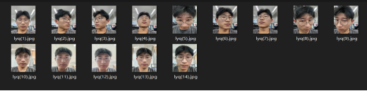
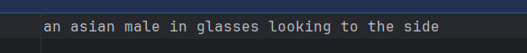
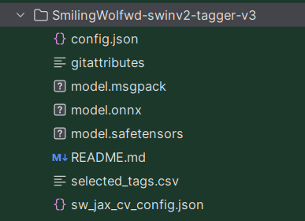
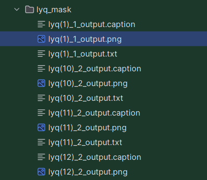
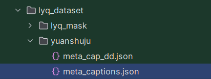
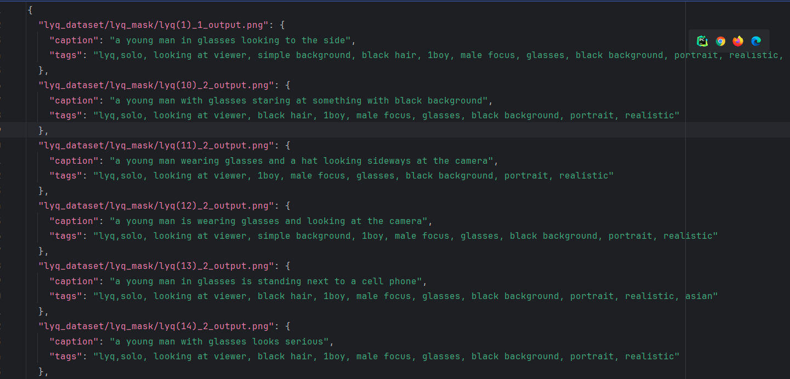

# Lora trian
## 安装库 requirements.txt
该文件未包含PyTorch的版本要求，因为PyTorch的版本依赖于环境配置，因此未在文件中列出。请根据您的环境先行安装PyTorch:
```
pip install -r requirement.txt
```

## 使用文档链接


[由 darkstorm2150 提供的英文翻译在此](https://github.com/darkstorm2150/sd-scripts#links-to-usage-documentation).

* [训练指南 - 常见](./docs/train_README-ja.md) : 数据描述，选项等...
  * [中文版本](./docs/train_README-zh.md)
* [SDXL 训练](./docs/train_SDXL-en.md) (英文版本)
* [数据集 config](./docs/config_README-ja.md) 
  * [英文版本](./docs/config_README-en.md)
* [DreamBooth 训练 指导](./docs/train_db_README-ja.md)
* [逐步微调指南](./docs/fine_tune_README_ja.md):
* [Lora 训练](./docs/train_network_README-ja.md)
* [训练文本反转](./docs/train_ti_README-ja.md)
* [图片生成](./docs/gen_img_README-ja.md)
* note.com [模型转换](https://note.com/kohya_ss/n/n374f316fe4ad)

## Windows 所需依赖项
Virtual environment: Python 3.10.6

## Windows 安装
打开一个普通的Powershell终端，在里面输入以下命令：:
```
git clone git@github.com:xxxxxxxxxxxxxxxxxxx20gex/Lora.git
cd sd-scripts
conda activate ‘你创建的虚拟环境’
pip install torch==2.1.2 torchvision==0.16.2 --index-url https://download.pytorch.org/whl/cu118
pip install --upgrade -r requirements.txt
pip install xformers==0.0.23.post1 --index-url https://download.pytorch.org/whl/cu118

accelerate config
```
## 步骤一：数据集准备
因为要训人脸lora，所以用手机拍摄的一些人脸照片，尺寸为3000*4000，尺寸大能涵盖更多特征细节。

主要采集了人脸图片（数据集1）（主要调整角度为正、侧、上下摆头，其他元素未变）。
```angular2html
#数据集保存路径
sd-scripts-main/lyqface_r
```
（选做）这里我对人脸数据集进行了抠图，只保留了人脸图像。数据集路径为`./lyq_dataset/lyq_mask`
## 步骤二：元数据处理
详情请参照[训练预处理](./docs/train_README-zh.md)
### 1. caption生成
caption就是图的标题，我们需要用BLIP来生成每一张图片的captions。
我们要生成人脸`lyqface_r`数据集的captions,并且此时没有元数据，请运行下面的指令：
```
# python finetune/make_captions.py --batch_size <batchsize> <数据集路径>
python finetune/make_captions.py --batch_size 8 ./lyq_dataset/lyq_mask
```
caption文件创建在人脸数据集合相同的目录中，具有相同的文件名和扩展名.caption。如下图展示：

captions标题如下：

### 2. 标签生成
此过程使用 WD14Tagger 进行标签的生成。可在`tag-wd14.sh`内部进行数据集位置的修改与参数的修改后运行。
<br>具体用法可参照[wd14_tagger](./docs/wd14_tagger_README-en.md) 。
<br>第一次国内运行需要下载模型，这里建议直接离线下载模型网上搜索SmilingWolfwd-swinv2-tagger-v
<br>文件结构如下:<br>
,
```
sh tag-wd14.sh
```
参数介绍：
- `--onnx`: 使用ONNX进行推理。如果没有指定，将使用TensorFlow。如果使用TensorFlow，请单独安装。
- `--thresh 0.8` : 阈值，数值越高则生成的标签越精确，字数越少。
- `--remove_underscore` : 去除掉生成标签中的下划线。
- `--model_dir`  下载的生成模型保存路径。
- `最后一行是数据集路径` 生成的标签也将在此出现。

<br>案例展示：<br>


### 3. captions 、标签处理 元数据制作）
#### 3.1 captions预处理
将caption和标签作为元数据合并到一个文件中.<br>
要将caption放入元数据中，请在您的工作文件夹中查看以下命令指定。
* `--full_path` 选项以将图像文件的完整路径存储在元数据中。如果省略此选项，则会记录相对路径，但 .toml 文件中需要单独的文件夹规范。
* `--in_json` 将生成的文件与现有的元数据文件合并，如果不使用此参数将会导致覆盖。
```
python merge_captions_to_metadata.py --full_path <数据集文件>
　  --in_json <要读取的元数据文件名> <元数据文件名>
```
元数据文件名是任意名称。 如果训练数据集为lyq_mask，没有读取元数据文件，元数据文件为meta_captions，则会如下。
```
python ./finetune/merge_captions_to_metadata.py --full_path ./lyq_dataset/lyq_mask meta_captions.json
```
生成的文件会保存在根目录下，我将其转移到sd-scripts-main/lyq_dataset/yuanshuju中。<br>
如果有多个数据集文件夹，请指定 full_path 参数并为每个文件夹执行。
```
python ./finetune/merge_captions_to_metadata.py --full_path 
    train_data1 meta_cap1.json
python ./finetune/merge_captions_to_metadata.py --full_path --in_json meta_cap1.json 
    train_data2 meta_cap2.json
```

#### 3.2 标签预处理
同样，标签也收集在元数据中
```
python ./finetune/merge_dd_tags_to_metadata.py --full_path <数据集文件> 
    --in_json <要读取的元数据文件名> <要写入的元数据文件名>
```
同样的目录结构，读取meta_cap.json和写入meta_cap_dd.json时，会是这样的。
```
python ./finetune/merge_dd_tags_to_metadata.py --full_path ./lyq_dataset/lyq_mask --in_json ./lyq_dataset/yuanshuju/meta_captions.json  meta_cap_dd.json
```

同样生成的文件会保存在根目录下，我将其转移到sd-scripts-main/lyq_dataset/yuanshuju中。<br>
如果有多个数据文件夹，请指定 full_path 参数并为每个文件夹执行。
```
python merge_dd_tags_to_metadata.py --full_path --in_json meta_cap2.json
    train_data1 meta_cap_dd1.json
python merge_dd_tags_to_metadata.py --full_path --in_json meta_cap_dd1.json 
    train_data2 meta_cap_dd2.json
```

元数据结构示例展示：

#### 3.3 标签清洗
查看 meta_cap_dd.json 元数据文件，我进行手动清理，将标签添加了第一个字符‘lyq’用于lora训练的第一个提示词，提示词的顺序也决定了权重的大小。
<br>示例展示：

上述内容掌握熟练后可直接运行sh文件：
```
sh tag-wd14.sh
```

## 步骤三： 数据集配置文件
详情请参照[训练lora与详细参数](./docs/train_README-zh.md)<br>
配置文件详细参数解释[训练配置文件参数](./docs/config_README-en.md)

在我们完成了数据集制作和元数据制作之后进行训练数据配置文件的编写。<br>
创建一个文本文件，并将其扩展名更改为.toml。例如，您可以按以下方式进行描述：
```
[general]             
shuffle_caption = true
keep_tokens = 2

[[datasets]] 
resolution = 512      # 图像分辨率
batch_size = 16        # 批次大小
enable_bucket = true  # 长宽桶
num_repeats = 2       # 图像在训练过程中重复的次数

  [[datasets.subsets]]
  image_dir = './lyq_dataset/lyq_mask'    # 指定包含训练图像的文件夹
  metadata_file = './lyq_dataset/yuanshuju/meta_cap_dd.json' # 元数据文件名
```

## 步骤四： 训练lora
<br>我们使用的方式是 **finetune** 方式进行lora训练。<br>
详情请参照[训练lora与启动命令](./docs/train_network_README-zh.md)<br>
参数详情请参照[train_network.py中详细参数](./docs/train_README-zh.md)

在train_network.py中，使用--network_module选项指定要训练的模块名称。对于LoRA模块，它应该是network.lora，请指定它。
运行参数如下：
```
accelerate launch --num_cpu_threads_per_process 1 train_network.py 
    --pretrained_model_name_or_path=./checkpoint/stable-diffusion-v1-5.safetensors
    --dataset_config=./config_lora.toml 
    --output_dir=./output 
    --output_name=lyq
    --save_model_as=safetensors 
    --prior_loss_weight=1.0 
    --max_train_epochs=20   
    --learning_rate=1e-4 
    --optimizer_type="AdamW8bit" 
    --xformers 
    --mixed_precision="fp16" 
    --cache_latents 
    --gradient_checkpointing 
    --save_every_n_epochs=200 
    --network_module=networks.lora
```
- `--pretrained_model_name_or_path` 指定预训练模型的路径或名称
- `--dataset_config` 指定数据集配置文件的路径
- `--output_dir` 指定训练后的模型保存的目录
- `--output_name` 保存模型时的文件名
- `--save_model_as` 定义保存模型的格式
- `--prior_loss_weight` 控制预训练模型的损失权重。在 LoRA 模型中，可以调整这个权重来平衡原始模型与 LoRA 微调之间的关系。值越大，意味着更多地依赖预训练模型的知识。
- `--max_train_epochs` 设置训练的最大轮数。
- `--learning_rate`  设置学习率
- `--optimizer_type` 选择优化器类型
- `--xformers `  它是一个用于优化计算图的库，能够减少显存使用并加速训练，特别是在大规模模型训练时。
- `--mixed_precision` 使用混合精度训练。
- `--cache_latents `  启用缓存潜在向量。通常是在训练时将图像编码成潜在表示（latents）并缓存它们以加速训练过程。
- `--gradient_checkpointing ` 启用梯度检查点，减小显存消耗。在长时间训练的大模型中非常有用，通过分阶段保存梯度计算，降低内存需求。
- `--save_every_n_epochs=2 ` 每训练2个周期保存一次模型。
- `--network_module` 指定训练中使用的网络模块。选择 networks.lora，训练一个 LoRA 模型。

<br>可在sh文件中进行参数修改后直接运行：
```
sh train_lora
```


